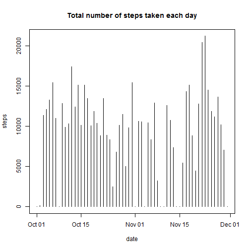
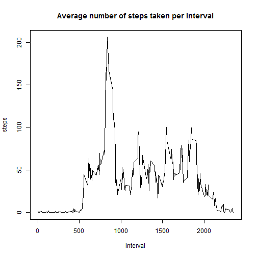
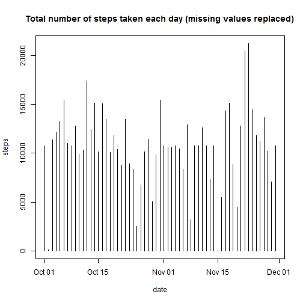
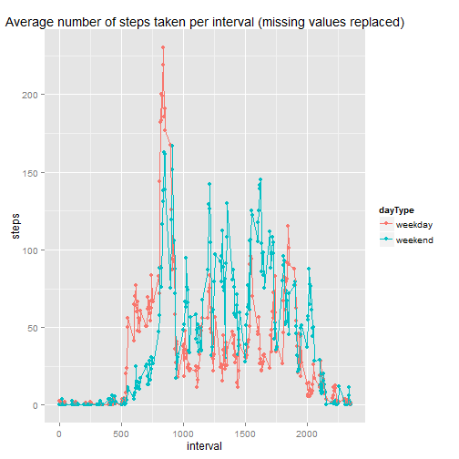

# Reproducible Research: Peer Assessment 1


## Loading and preprocessing the data
Data is loaded using data.table package (it assumes it is already installed).
I chose working with data.table because I find it quiet useful for subsetting and merging.
I would also like to practice its syntax ( a bit different from that use to work with data.frames)

Target file (`activity.csv`) must be in the working directory.

 

```r
library(data.table)
data <- fread(input = "activity.csv")
```

I check column classes

```r
sapply(data[1,], class)
```

```
##       steps        date    interval 
##   "integer" "character"   "integer"
```

I convert `date` column to date class:

```r
data[,date:= as.Date(date)]
```

```
##        steps       date interval
##     1:    NA 2012-10-01        0
##     2:    NA 2012-10-01        5
##     3:    NA 2012-10-01       10
##     4:    NA 2012-10-01       15
##     5:    NA 2012-10-01       20
##    ---                          
## 17564:    NA 2012-11-30     2335
## 17565:    NA 2012-11-30     2340
## 17566:    NA 2012-11-30     2345
## 17567:    NA 2012-11-30     2350
## 17568:    NA 2012-11-30     2355
```

## What is mean total number of steps taken per day?

* **Make a histogram of the total number of steps taken each day**  

Sum of steps are subset by `date` and storaged in an object called `daily.steps`  

```r
setkey(data, date)
daily.steps <- data[,list( steps = sum(steps, na.rm = TRUE) ), by = date]
```
Here follows first 5 rows of `daily.steps`:  

```r
daily.steps[1:5]
```

```
##          date steps
## 1: 2012-10-01     0
## 2: 2012-10-02   126
## 3: 2012-10-03 11352
## 4: 2012-10-04 12116
## 5: 2012-10-05 13294
```
And here is the histogram:  

```r
with(daily.steps, 
     plot(steps ~ date, type = "h", 
          xlab = "date", ylab = "steps",
          main = "Total number of steps taken each day")
)
```

 

* **Calculate and report the mean and median total number of steps taken per day**  

Here is the code:

```r
daily.mean <- daily.steps[,mean(steps)]
daily.median <- daily.steps[,median(steps)]
```
And here come the values:

```r
daily.mean
```

```
## [1] 9354
```

```r
daily.median
```

```
## [1] 10395
```

## What is the average daily activity pattern?

* **Make a time series plot  (i.e. `type = "l"`) of the 5-minute interval (x-axis) and the average number of steps taken, averaged across all days (y-axis)**

A new subset of `data` is done (by `interval`) and storaged in and object called **interval.steps**  

```r
setkey(data, interval)
interval.steps <- data[,list(meanSteps = mean(steps, na.rm = TRUE)), by= interval]
interval.steps
```

```
##      interval meanSteps
##   1:        0   1.71698
##   2:        5   0.33962
##   3:       10   0.13208
##   4:       15   0.15094
##   5:       20   0.07547
##  ---                   
## 284:     2335   4.69811
## 285:     2340   3.30189
## 286:     2345   0.64151
## 287:     2350   0.22642
## 288:     2355   1.07547
```
And here is the plot:  

```r
with(interval.steps,
     plot(meanSteps ~ interval, type = "l",
          xlab = "interval", ylab = "steps",
          main = "Average number of steps taken per interval"
          )
     )
```

 

From time to time I would not mind to be in Baltimore, where days have 2400 minutes ;)  
(I guess one hour have 100 minutes, that matches)

* **Which 5-minute interval, on average across all the days in the dataset, contains the maximum number of steps?**

I guess there is a prettier way of coding this, but here it goes:

```r
max.index <- which(interval.steps$meanSteps == max(interval.steps$meanSteps))
interval.max <- interval.steps$interval[max.index]
```
And our 5-minute interval is:

```r
interval.max
```

```
## [1] 835
```
What matches the previous graph.  
Just for check:

```r
interval.steps[max.index]
```

```
##    interval meanSteps
## 1:      835     206.2
```
## Imputing missing values

* **Calculate and report the total number of missing values in the dataset (i.e. the total number of rows with `NA`s)**

```r
missing <- sum(is.na(data$steps))
missing
```

```
## [1] 2304
```

* **Devise a strategy for filling in all of the missing values in the dataset.**

I will use the mean for that 5-minute interval.  
I first create an object called `is.missing` where I store the filling values to be used.  
Note that mean for that 5-minute interval is rounded to the closest integer.

```r
is.missing <- interval.steps[,list(interval, meanSteps = as.integer(  round(meanSteps))  )]
is.missing
```

```
##      interval meanSteps
##   1:        0         2
##   2:        5         0
##   3:       10         0
##   4:       15         0
##   5:       20         0
##  ---                   
## 284:     2335         5
## 285:     2340         3
## 286:     2345         1
## 287:     2350         0
## 288:     2355         1
```


* **Create a new dataset that is equal to the original dataset but with the missing data filled in.**

The new data set is called `data1`.  
It is a merge of `data` and `is.missing` objects by `interval` column.
Here is the code:

```r
setkey(data, interval)
setkey(is.missing, interval)
data1 <- data[is.missing]
```
And this is how `data1` looks like:

```r
data1
```

```
##        interval steps       date meanSteps
##     1:        0    NA 2012-10-01         2
##     2:        0     0 2012-10-02         2
##     3:        0     0 2012-10-03         2
##     4:        0    47 2012-10-04         2
##     5:        0     0 2012-10-05         2
##    ---                                    
## 17564:     2355     0 2012-11-26         1
## 17565:     2355     0 2012-11-27         1
## 17566:     2355     0 2012-11-28         1
## 17567:     2355     0 2012-11-29         1
## 17568:     2355    NA 2012-11-30         1
```
Note the column at the right, `meanSteps`, which has the fillling values.  
Now, I use these values to replace `NA` values at `steps` column.  
`meanSteps` is deleted after that.

```r
data1[is.na(data1$steps), steps:= meanSteps]
```

```
##        interval steps       date meanSteps
##     1:        0     2 2012-10-01         2
##     2:        0     0 2012-10-02         2
##     3:        0     0 2012-10-03         2
##     4:        0    47 2012-10-04         2
##     5:        0     0 2012-10-05         2
##    ---                                    
## 17564:     2355     0 2012-11-26         1
## 17565:     2355     0 2012-11-27         1
## 17566:     2355     0 2012-11-28         1
## 17567:     2355     0 2012-11-29         1
## 17568:     2355     1 2012-11-30         1
```

```r
data1[,meanSteps:= NULL]
```

```
##        interval steps       date
##     1:        0     2 2012-10-01
##     2:        0     0 2012-10-02
##     3:        0     0 2012-10-03
##     4:        0    47 2012-10-04
##     5:        0     0 2012-10-05
##    ---                          
## 17564:     2355     0 2012-11-26
## 17565:     2355     0 2012-11-27
## 17566:     2355     0 2012-11-28
## 17567:     2355     0 2012-11-29
## 17568:     2355     1 2012-11-30
```

* **Make a histogram of the total number of steps taken each day and Calculate and report the mean and median total number of steps taken per day.**

Sum of steps are subset by `date` and storaged in an object called `daily.steps`  

```r
setkey(data1, date)
daily.steps1 <- data1[,list( steps = sum(steps, na.rm = TRUE) ), by = date]
```
  
And here is the new histogram:  

```r
with(daily.steps1, 
     plot(steps ~ date, type = "h", 
          xlab = "date", ylab = "steps",
          main = "Total number of steps taken each day (missing values replaced)")
)
```

 


Here is the code for median and mean calculation:

```r
daily.mean1 <- daily.steps1[,mean(steps)]
daily.median1 <- daily.steps1[,median(steps)]
```

And here come the values:

```r
daily.mean1
```

```
## [1] 10766
```

```r
daily.median1
```

```
## [1] 10762
```

* **Do these values differ from the estimates from the first part of the assignment? What is the impact of imputing missing data on the estimates of the total daily number of steps?**

Yes they do. Both estimates have risen. 

## Are there differences in activity patterns between weekdays and weekends?

* **Create a new factor variable in the dataset with two levels -- "weekday" and "weekend" indicating whether a given date is a weekday or weekend day.**

An extra column is created in `data1` (`dateType`) where the day of the week is storaged (i.e. Mon, Tue...).

```r
setkey(data1, date)
data1[,dayType:= format(date, "%a")]
```

```
##        interval steps       date dayType
##     1:        0     2 2012-10-01     Mon
##     2:        5     0 2012-10-01     Mon
##     3:       10     0 2012-10-01     Mon
##     4:       15     0 2012-10-01     Mon
##     5:       20     0 2012-10-01     Mon
##    ---                                  
## 17564:     2335     5 2012-11-30     Fri
## 17565:     2340     3 2012-11-30     Fri
## 17566:     2345     1 2012-11-30     Fri
## 17567:     2350     0 2012-11-30     Fri
## 17568:     2355     1 2012-11-30     Fri
```

```r
setkey(data1, dayType)
```

Now we group weekdays into `Weekday` or `Weekend`.

```r
data1[dayType %in% c("Mon", "Tue", "Wed", "Thu", "Fri"), dayType:= "weekday"]
```

```
##        interval steps       date dayType
##     1:        0     0 2012-10-05 weekday
##     2:        5     0 2012-10-05 weekday
##     3:       10     0 2012-10-05 weekday
##     4:       15     0 2012-10-05 weekday
##     5:       20     0 2012-10-05 weekday
##    ---                                  
## 17564:     2335     0 2012-11-28 weekday
## 17565:     2340     0 2012-11-28 weekday
## 17566:     2345     0 2012-11-28 weekday
## 17567:     2350     0 2012-11-28 weekday
## 17568:     2355     0 2012-11-28 weekday
```

```r
data1[dayType %in% c("Sat", "Sun"), dayType:= "weekend"]
```

```
##        interval steps       date dayType
##     1:        0     0 2012-10-05 weekday
##     2:        5     0 2012-10-05 weekday
##     3:       10     0 2012-10-05 weekday
##     4:       15     0 2012-10-05 weekday
##     5:       20     0 2012-10-05 weekday
##    ---                                  
## 17564:     2335     0 2012-11-28 weekday
## 17565:     2340     0 2012-11-28 weekday
## 17566:     2345     0 2012-11-28 weekday
## 17567:     2350     0 2012-11-28 weekday
## 17568:     2355     0 2012-11-28 weekday
```

I checked that we have just these two levels:

```r
unique(data1$dayType)
```

```
## [1] "weekday" "weekend"
```
* **Make a panel plot containing a time series plot (i.e. `type = "l"`) of the 5-minute interval (x-axis) and the average number of steps taken, averaged across all weekday days or weekend days (y-axis).**

Sum of steps are now subset by `dayType` and `interval` and storaged in an object called `intervaldaytype`

```r
setkey(data1, dayType, interval)
intervaldaytype <- data1[,list( steps = mean(steps) ), by = "interval,dayType"]
intervaldaytype
```

```
##      interval dayType    steps
##   1:        0 weekday  2.28889
##   2:        5 weekday  0.40000
##   3:       10 weekday  0.15556
##   4:       15 weekday  0.17778
##   5:       20 weekday  0.08889
##  ---                          
## 572:     2335 weekend 11.62500
## 573:     2340 weekend  6.25000
## 574:     2345 weekend  1.75000
## 575:     2350 weekend  0.00000
## 576:     2355 weekend  0.12500
```


Now `intervaldaytype` is plot using `ggplot2`, using `dayType` as color label

```r
library(ggplot2)
plot <- qplot(interval, steps, data=intervaldaytype, color=dayType) + geom_line()
plot <- plot + ggtitle("Average number of steps taken per interval (missing values replaced)")
plot
```

 
